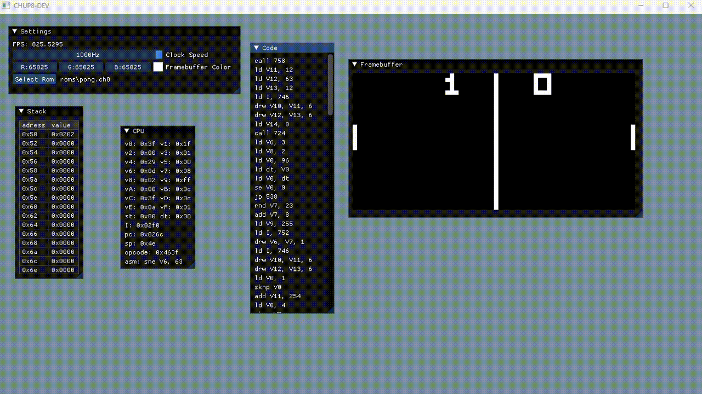

# Chip8dev

A CHIP-8 emulator and disassembler in C++. UI is made with Dear ImGui. Still in progress.

## Upcoming features:
- Debugger(breakpoints, edit & continue, time traveling)
- Compiler from a custom high-level language (C-inspired) to CHIP-8 bytecode.
